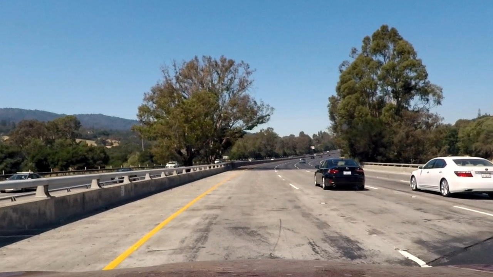
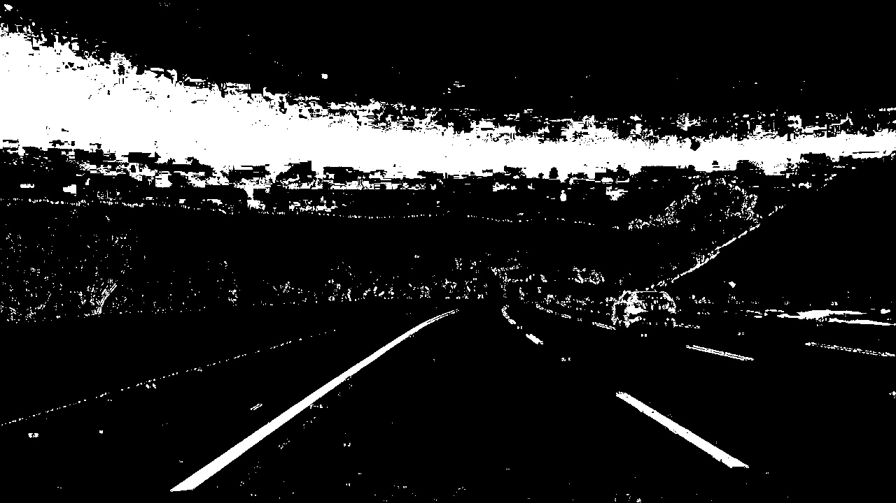
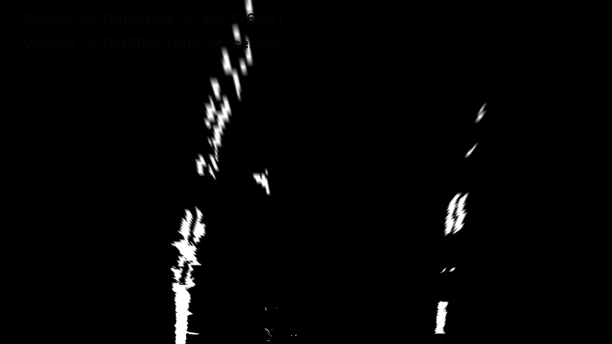
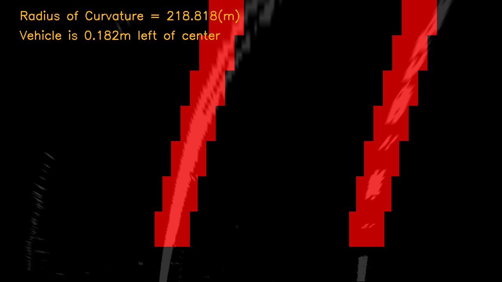
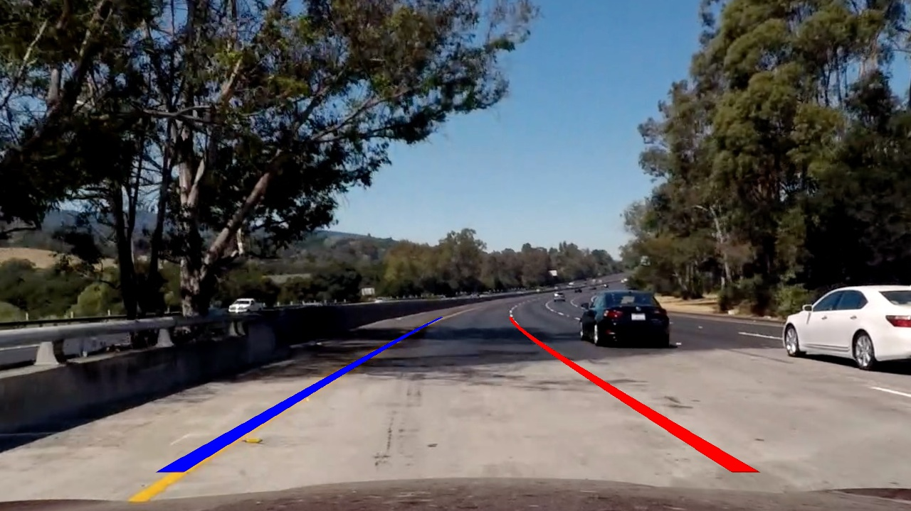

## Advanced Lane Finding

The goal of this project is to identify road lanes in a video stream of a forward facing camera mounted centeraly in a moving vehicle.

We'll be using image manipulation techniques to extract enough information from each frame, or image, of the video and identify the lane lines, the radius of curvature and the distance from the camera to the center line of the road  

>## Project Structure
---

* __camera_cal__: contains calibrated images.
* __Corners_output__: contains Chess board images with detected corners.
* __output_images__: contains images with lane lines detected.
* __test_images__: contains test images to be used.
* __threshold_output__: contains images with thresholding applied to them.
* __undistorted_images__: contains the undistorted version of test images.
* __warped_output__: contains images with perspective transform applied to them.

>## The Project Overview
---
* __Camera Calibration__ - Calibrate the camera to correct for image distortions. For this we use a set of chessboard images, knowing the distance and angles between common features like corners, we can calculate the tranformation functions and apply them to the video frames.

* __Color Transform__ - We use a set of image manipulation techniques to accentuate certain features like lane lines. We use color space transformations, like from RGB to HLS, channel separation, like separating the S channel from the HLS image and image gradient to allow us to identify the desired lines.

* __Perspective Transform__ - We apply a "bird’s-eye view transform" that let's us view a lane from above and thus identify the lane lines, mesure its curvature and respective radius.
* __Lane Pixel Detection__ - We then analyse the transformed image and try to detect the lane pixels. We use a series of windows and identify the lane lines by finding the peeks in a histogram of each window's.

* __Pipeline__ - We finally put it all together in a pipeline so we can apply it to the video stream.

>## Camera Calibration
The OpenCV functions findChessboardCorners and calibrateCamera are the backbone of the image calibration. A number of images of a chessboard, taken from different angles with the same camera, comprise the input. Arrays of object points, corresponding to the location (essentially indices) of internal corners of a chessboard, and image points, the pixel locations of the internal chessboard corners determined by findChessboardCorners, are fed to calibrateCamera which returns camera calibration and distortion coefficients. These can then be used by the OpenCV undistort function to undo the effects of distortion on any image produced by the same camera. Generally, these coefficients will not change for a given camera (and lens). The below image depicts the corners drawn onto twenty chessboard images using the OpenCV function drawChessboardCorners

Example:

We save the camera matrix and the distortion matrix in a dictionary to use these values to undistort our test images and then subsequently use them in our pipeline.

Example:

>## Color Transform
Here we use a series of image manipulation techniquest to detect the edges, lines, of an image.

To be more specific we used absolute x & y gradient thresholds , an S-channel threshold using this HLS color space and V-channel threshold using the HSV color space.

After applying all of the transformations we can extract the edges from the road:

>## Perspective Transform
Using trail and error I came up with 4 trapezoidal points in the real image which are transformed into a square in the warped image.

We make use of OpenCV function called getPerspectiveTransform and warpPerspective to obtain the birds-eye view of the road.

>## Lane Pixel Detection:
Here I used a 1-D convolutional layer to detect hot-pixels in a window of the image. The image is broken down into various segments over which we iterate to detect the lane lines.

>## Pipeline
 Now inorder to apply these functions in a video-stream we sequentially apply color-gradient transform, then change the perspective of the image, detect left and right lanes using the tracker function and then revert back to the original image with left and right lanes being drawn on it.
 

 >## Discussion
 
 It's obvious that the model does not perform well in challenging problems. The lane boundary is "all over the place" and could not keep the car inside the lane. This is most likely due to the nature of the road, single line for each traffic direction, steeper bends and a higher proximity to the side of the road.

 The problems I encountered were almost exclusively due to lighting conditions, shadows, discoloration, etc. It wasn't difficult to dial in threshold parameters to get the pipeline to perform well on the original project video but it was very difficult in the case of harder challenge and challenge video.

